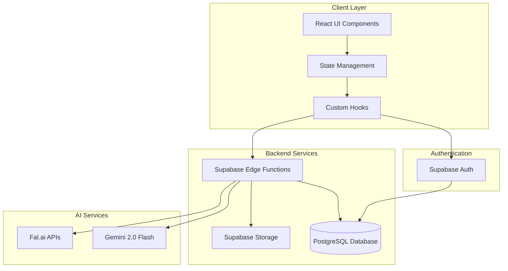
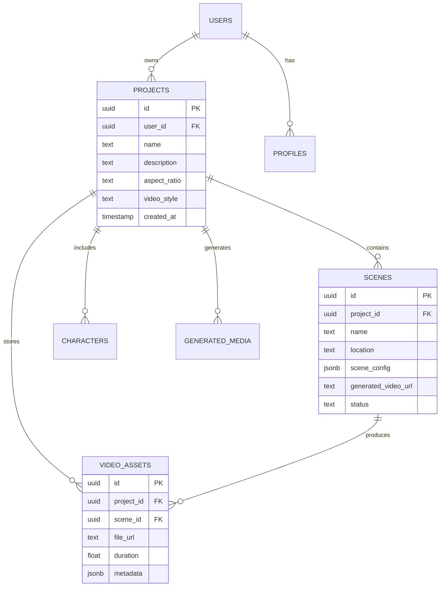

# 🍌 BananaClip Creative Studio

> **AI-Powered Creative Content Generation Platform**  
> Transform ideas into stunning visual content with dual-workflow creative suite

[](https://www.typescriptlang.org/)
[](https://reactjs.org/)
[](https://supabase.com/)
[](https://vitejs.dev/)

## 📋 Table of Contents

- [Overview](#overview)
- [Project Architecture](#project-architecture)
- [Core Features](#core-features)
- [Technology Stack](#technology-stack)
- [Getting Started](#getting-started)
- [Project Structure](#project-structure)
- [Database Schema](#database-schema)
- [API Documentation](#api-documentation)
- [Deployment](#deployment)
- [Contributing](#contributing)
- [License](#license)

## 🎯 Overview

BananaClip is a sophisticated AI-powered creative studio that combines two powerful workflows:

### **Nano Banana Studio** 
AI video scene generator and editor leveraging Fal.ai's advanced video generation capabilities for creating dynamic scenes from sketches and reference images.

### **AdBanana Studio**
Comprehensive ad-creative builder that generates complete advertising packages with copy, visuals, captions, and multi-variant outputs optimized for different platforms.

## 🏗️ Project Architecture



### System Components

#### **Frontend Architecture**
```
┌─────────────────────────────────────────┐
│            React Application            │
├─────────────────────────────────────────┤
│  ┌───────────┐  ┌──────────────────┐  │
│  │   Pages   │  │    Components    │  │
│  └───────────┘  └──────────────────┘  │
│  ┌───────────┐  ┌──────────────────┐  │
│  │   Hooks   │  │     Services     │  │
│  └───────────┘  └──────────────────┘  │
│  ┌─────────────────────────────────┐  │
│  │    State Management (Zustand)    │  │
│  └─────────────────────────────────┘  │
└─────────────────────────────────────────┘
```

#### **Backend Architecture**
```
┌─────────────────────────────────────────┐
│         Supabase Backend Services       │
├─────────────────────────────────────────┤
│  ┌─────────────────────────────────┐  │
│  │      Edge Functions (Deno)       │  │
│  │  • banana-clip                   │  │
│  │  • generate-images-gemini        │  │
│  │  • stitch-videos-fal            │  │
│  └─────────────────────────────────┘  │
│  ┌─────────────────────────────────┐  │
│  │     PostgreSQL Database          │  │
│  └─────────────────────────────────┘  │
│  ┌─────────────────────────────────┐  │
│  │      File Storage (S3)           │  │
│  └─────────────────────────────────┘  │
└─────────────────────────────────────────┘
```

## 🚀 Core Features

### Nano Banana Studio
- **🎨 Creative Sketch Canvas**: Freehand drawing tool with brush controls
- **📸 Reference Image Upload**: Support for multiple reference images
- **🤖 AI Scene Generation**: Powered by Gemini 2.0 Flash
- **🎬 Video Generation**: Convert images to videos using Fal.ai
- **🔗 Batch Processing**: Generate multiple videos simultaneously
- **🎞️ Video Stitching**: Combine multiple clips into single video

### AdBanana Studio
- **📝 Ad Brief Builder**: Comprehensive creative brief system
- **🎯 Platform Optimization**: Auto-adjust for TikTok, Instagram, YouTube
- **💡 Copy Generation**: AI-powered hooks, beats, and CTAs
- **🔄 Variant Generation**: Create multiple ad variations
- **📊 Export Options**: JSON, SRT captions, formatted scripts

## 💻 Technology Stack

### Frontend
- **Framework**: React 18.3 with TypeScript 5.6
- **Build Tool**: Vite 6.0
- **Styling**: Tailwind CSS 3.4 + shadcn/ui components
- **State Management**: Custom hooks + Context API
- **Routing**: React Router v6
- **Forms**: React Hook Form + Zod validation

### Backend
- **Platform**: Supabase (BaaS)
- **Edge Functions**: Deno runtime with TypeScript
- **Database**: PostgreSQL 15
- **Authentication**: Supabase Auth (JWT-based)
- **File Storage**: Supabase Storage (S3-compatible)

### AI/ML Services
- **Image Generation**: Google Gemini 2.0 Flash
- **Video Generation**: Fal.ai video APIs
- **Image Upscaling**: Fal.ai upscaling service
- **Video Processing**: FFmpeg API via Fal.ai

### Development Tools
- **Package Manager**: npm/bun
- **Linting**: ESLint with TypeScript rules
- **Version Control**: Git
- **Deployment**: Supabase CLI + Lovable.dev

## 🛠️ Getting Started

### Prerequisites
- Node.js 18+ and npm/bun
- Supabase CLI
- Git

### Environment Variables
Create a `.env.local` file:
```env
# Supabase Configuration
VITE_SUPABASE_URL=your_supabase_url
VITE_SUPABASE_ANON_KEY=your_supabase_anon_key

# API Keys (set in Supabase secrets)
GEMINI_API_KEY=your_gemini_api_key
FAL_KEY=your_fal_api_key
```

### Installation

1. **Clone the repository**
```bash
git clone https://github.com/yourusername/bananaclip.git
cd bananaclip
```

2. **Install dependencies**
```bash
npm install
```

3. **Set up Supabase locally**
```bash
supabase start
```

4. **Run database migrations**
```bash
supabase db push
```

5. **Deploy Edge Functions**
```bash
supabase functions deploy banana-clip --no-verify-jwt
supabase functions deploy generate-images-gemini
supabase functions deploy stitch-videos-fal
```

6. **Start development server**
```bash
npm run dev
```

## 📁 Project Structure

```
bananaclip/
├── src/
│   ├── components/
│   │   ├── studio/         # Studio components
│   │   │   ├── NanoBananaStudio.tsx
│   │   │   ├── AdBananaStudio.tsx
│   │   │   └── VideoGenerationModal.tsx
│   │   ├── projects/       # Project management
│   │   │   ├── ProjectSwitcher.tsx
│   │   │   ├── CreateProjectDialog.tsx
│   │   │   └── ProjectCard.tsx
│   │   ├── ui/            # Reusable UI components
│   │   └── nano/          # Nano-specific components
│   ├── hooks/             # Custom React hooks
│   │   ├── useAuth.tsx
│   │   ├── useProjects.ts
│   │   ├── useAdBanana.ts
│   │   └── useFalUpscale.ts
│   ├── services/          # External service integrations
│   │   ├── geminiService.ts
│   │   ├── falService.ts
│   │   └── videoService.ts
│   ├── lib/              # Utilities and schemas
│   │   ├── schemas.ts
│   │   └── utils.ts
│   ├── pages/            # Route components
│   │   ├── Index.tsx
│   │   ├── Auth.tsx
│   │   └── NotFound.tsx
│   └── integrations/     # Third-party integrations
│       └── supabase/
├── supabase/
│   ├── functions/        # Edge Functions
│   │   ├── banana-clip/
│   │   ├── generate-images-gemini/
│   │   └── stitch-videos-fal/
│   └── migrations/       # Database migrations
├── public/              # Static assets
└── package.json
```

## 🗄️ Database Schema

### Core Tables

#### **projects**
```sql
CREATE TABLE projects (
  id UUID PRIMARY KEY DEFAULT gen_random_uuid(),
  user_id UUID NOT NULL REFERENCES auth.users(id),
  name TEXT NOT NULL,
  description TEXT,
  aspect_ratio TEXT DEFAULT '16:9',
  video_style TEXT DEFAULT 'Cinematic',
  created_at TIMESTAMPTZ DEFAULT now(),
  updated_at TIMESTAMPTZ DEFAULT now()
);
```

#### **scenes**
```sql
CREATE TABLE scenes (
  id UUID PRIMARY KEY DEFAULT gen_random_uuid(),
  project_id UUID REFERENCES projects(id) ON DELETE CASCADE,
  name TEXT NOT NULL,
  location TEXT,
  lighting TEXT,
  weather TEXT,
  description TEXT,
  voiceover TEXT,
  scene_config JSONB,
  generated_video_url TEXT,
  status TEXT DEFAULT 'draft',
  created_at TIMESTAMPTZ DEFAULT now()
);
```

#### **video_assets**
```sql
CREATE TABLE video_assets (
  id UUID PRIMARY KEY DEFAULT gen_random_uuid(),
  project_id UUID REFERENCES projects(id) ON DELETE CASCADE,
  scene_id UUID REFERENCES scenes(id),
  file_name TEXT NOT NULL,
  file_url TEXT NOT NULL,
  file_size INTEGER,
  mime_type TEXT,
  duration FLOAT,
  asset_type TEXT,
  metadata JSONB,
  created_at TIMESTAMPTZ DEFAULT now()
);
```

#### **generated_media**
```sql
CREATE TABLE generated_media (
  id UUID PRIMARY KEY DEFAULT gen_random_uuid(),
  user_id UUID NOT NULL,
  project_id UUID REFERENCES projects(id),
  media_type TEXT NOT NULL,
  storage_path TEXT NOT NULL,
  storage_url TEXT,
  original_prompt TEXT,
  generation_params JSONB,
  file_size INTEGER,
  mime_type TEXT,
  created_at TIMESTAMPTZ DEFAULT now()
);
```

### Entity Relationship Diagram



## 📡 API Documentation

### Edge Functions

#### **POST /functions/v1/banana-clip/generate-images**
Generate images using Gemini 2.0 Flash

**Request:**
```typescript
{
  doodle_image: File,           // PNG/JPG sketch
  location_image_1-5: File[],   // Reference images
  description: {
    setting: string,
    subjects: string,
    composition: string,
    environment: string,
    lighting: string,
    focal_points: string,
    mood: string
  }
}
```

**Response:**
```typescript
{
  success: boolean,
  message: string,
  generated_images: [{
    id: string,
    base64_data: string,
    filename: string
  }],
  processing_time: number
}
```

#### **POST /functions/v1/stitch-videos-fal**
Stitch multiple videos into single output

**Request:**
```typescript
{
  videoUrls: string[],      // Array of video URLs
  projectName: string       // Output project name
}
```

**Response:**
```typescript
{
  video: {
    url: string,           // Stitched video URL
    duration: number
  },
  metadata: {
    inputCount: number,
    projectName: string,
    stitchedAt: string
  }
}
```

### Client SDK Usage

```typescript
// Image Generation
import { generateActualImagesFromCanvas } from '@/services/geminiService';

const images = await generateActualImagesFromCanvas(
  canvasData,        // Base64 canvas drawing
  uploadedImages,    // File array
  sceneDescription   // Scene config object
);

// Video Generation
import { generateVideoFromImage } from '@/services/videoService';

const video = await generateVideoFromImage(
  imageData,         // Base64 image
  prompt,           // Generation prompt
  aspectRatio       // Video aspect ratio
);

// Video Stitching
import { stitchVideos } from '@/hooks/useVideoStitching';

const result = await stitchVideos(
  videoUrls,        // Array of video URLs
  projectName       // Output name
);
```

## 🚀 Deployment

### Production Deployment (via Supabase)

1. **Configure production environment**
```bash
supabase link --project-ref your-project-ref
```

2. **Set production secrets**
```bash
supabase secrets set GEMINI_API_KEY=your_key
supabase secrets set FAL_KEY=your_key
```

3. **Deploy database migrations**
```bash
supabase db push
```

4. **Deploy Edge Functions**
```bash
supabase functions deploy --all
```

5. **Deploy frontend via Lovable**
- Open [Lovable](https://lovable.dev)
- Navigate to your project
- Click Share → Publish

### Custom Domain Setup
1. Navigate to Project → Settings → Domains in Lovable
2. Click "Connect Domain"
3. Follow DNS configuration instructions

## 🤝 Contributing

### Development Workflow

1. **Fork the repository**
2. **Create a feature branch**
   ```bash
   git checkout -b feature/amazing-feature
   ```
3. **Commit your changes**
   ```bash
   git commit -m 'Add amazing feature'
   ```
4. **Push to the branch**
   ```bash
   git push origin feature/amazing-feature
   ```
5. **Open a Pull Request**

### Code Style Guidelines

- Follow TypeScript best practices
- Use functional components with hooks
- Implement proper error handling
- Write meaningful commit messages
- Add JSDoc comments for complex functions
- Maintain consistent file structure

### Testing

```bash
# Run type checking
npm run type-check

# Run linting
npm run lint

# Run tests (when implemented)
npm run test
```

## 📈 Performance Optimization

### Current Optimizations
- Lazy loading of studio components
- Image compression before upload
- Debounced API calls
- Memoized expensive computations
- Optimistic UI updates

### Monitoring
- Supabase Dashboard for API metrics
- Browser DevTools for performance profiling
- Error tracking via console logs (consider Sentry integration)

## 🔒 Security Considerations

- JWT-based authentication via Supabase Auth
- Row Level Security (RLS) policies on all tables
- API key rotation schedule
- Input validation with Zod schemas
- XSS protection via React's built-in escaping
- CORS configuration on Edge Functions

## 📝 License

This project is proprietary software. All rights reserved.

## 🆘 Support

For issues and questions:
- Create an issue in the GitHub repository
- Contact support at support@bananaclip.ai
- Check [documentation](https://docs.bananaclip.ai)

## 🙏 Acknowledgments

- [Supabase](https://supabase.com) for backend infrastructure
- [Fal.ai](https://fal.ai) for video generation capabilities
- [Google Gemini](https://ai.google.dev) for image generation
- [shadcn/ui](https://ui.shadcn.com) for UI components
- [Lovable](https://lovable.dev) for deployment platform

---

**Built with 🍌 by 5-Dee Studios
